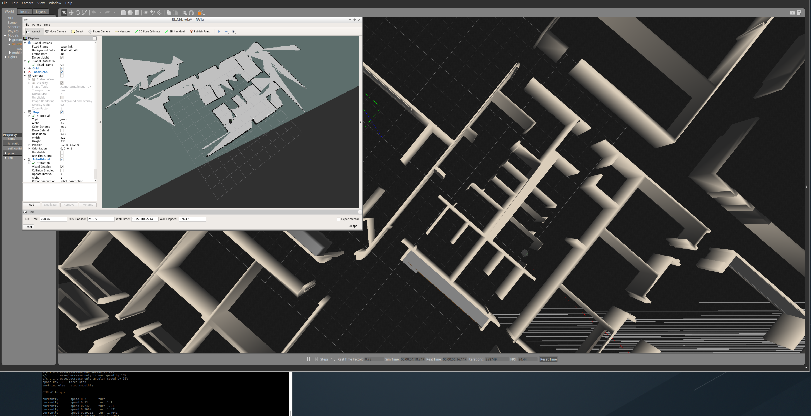

[](https://www.udacity.com/robotics)

# RoboND_SLAM
Robotics Software Engineer Lab "SLAM"

### Used Packages
[gmapping](http://wiki.ros.org/gmapping)

### Steps to launch the simulation

#### Step 1 Update and upgrade the Workspace image
```sh
$ sudo apt-get update
$ sudo apt-get upgrade -y
```

#### Step 2 Install dependencies
```sh
$ cd ..
$ source devel/setup.bash
$ rosdep -i install turtlebot_gazebo
$ rosdep -i install turtlebot_teleop
```
#### Step 3 Compile the code
```sh
$ catkin_make
```

#### Step 4 Source ROS in this workspace
```sh
$ source devel/setup.bash
```

#### Step 5 Run the Simulation  
```sh
$ roslaunch my_robot world.launch
```

#### Step 6 Navigate trought environment
```sh
$ roslaunch turtlebot_teleop keyboard_teleop.launch
```

#### Step 7 Save Map  
With the map_server you can load and save maps. Running map_server will generate the map.pgm and the map.yaml files.
```sh
$ rosrun map_server map_saver -f myMap
```

### Output



### Wondering why you got a bad quality map?
That’s because the gmapping parameters values used were the default values. In general, it’s essential to tune them in order to get a 100% accurate map. These parameters are all listed under the gmapping documentation, where you can look at them yourself. If you experiment with some of these parameter values, you should be able to get better maps. For example, you might try, reducing the angularUpdate and linearUpdate values so the map gets updated for smaller ranges of movements, reducing the x and y limits, which represent the initial map size, increasing the number of particles. You can try tweaking these parameters and/or any other parameter you think should be changed.
    


